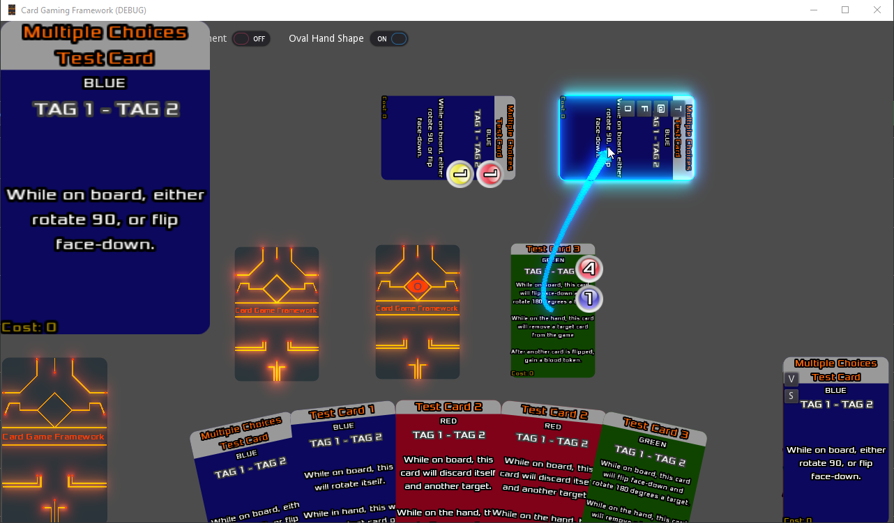
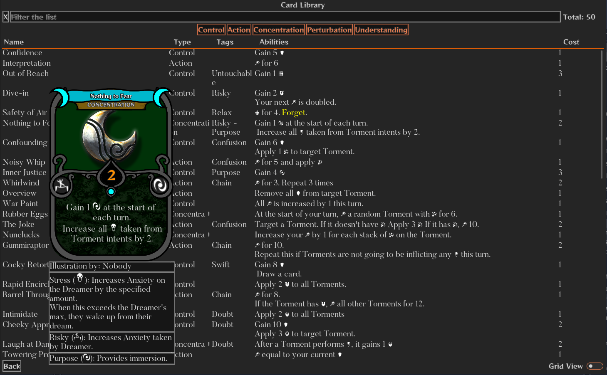
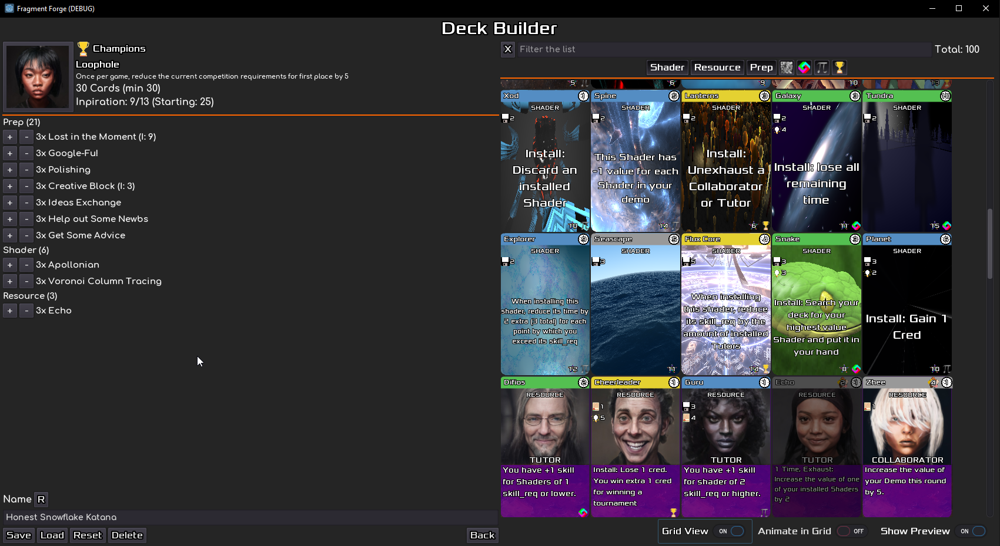

# Godot Card Game Framework [2.2](CHANGELOG.md)

This framework is meant to provide well designed, statically typed, and fully commented classes and scenes which you can plug into any potential card game to handle typical behaviour expected from cards in a game in a polished manner.

Pull requests are more than welcome ;)

## Provided features

* **Complete card text and rules enforcement** capacity, via provided Scripting Engine! (see scripting engine features, below)
* Tween & GDScript-based animations that look good for card movements.
* Customizable card highlights
* Supports Rich Text for card text, including embedded images.
* Choice between Oval or Straight hand shape
* Automatic focus-in on cards when moused over in-hand.
* Automatic re-arranging of hand as cards are added or removed.
* Drag & Drop of cards on table and between containers
* Supports having multiple hands and piles.
* Piles of cards represent their size visually.
* Larger image of card when moving mouse cursor over it
* Pop-up buttons for predefined functions on cards and card containers
* Option to look inside the piles and choose cards to move out
* Cards can rotate on the table
* Cards can attach to other cards and move together as a group.
* Cards can target other cards with a draggable arrow
* Can flip cards face-down and view them while in that state
* Can add tokens on cards. Tokens expand in the own drawer for more info.
* Ability to define cards in standard dictionaries
* Ability to split card definitions into sets
* Automatically resizing text inside cards to fit the card size.
* Supports resizing the window, in all stretch modes (including disabled stretch)
* Can select layout of your CardContainers from a simple drop-down menu.
* Automatic and manual Grid-based, or Free-form placement on the board, or a combination of both, on a per-card-type basis.
* Functions from saving/loading settings from disk.
* Caching mechanisms to reduce loading and instancing times.
* Collecting [game statistics](https://github.com/db0/CGF-Stats)
* Easy customization via Themes. [Dark Theme](https://mounirtohami.itch.io/godot-dark-theme) used in Demo, provided by Mounir Tohami
* A functional and customizable Card Library.

* A functional and customizable Deck Builder.

### Scripting Engine Features

* Can define card scripts in plain text, using dictionaries.
* Can set cards to trigger off of any board manipulation.
* Can filter the triggers based on card properties, or a special subset.
* Can define optional abilities.
* Can define multiple-choice abilities.
* Can calculate effect intensity based on state of the board during runtime.
* Can request simple inputs from the player during execution.
* Tag-marking scripts which can be filtered by scripts triggering off of them.
* Can store results from one script to use in another.
* Can be plugged into by any object, not just cards.

All of the above while being very easily extensible to your own game's special requirements through simple dictionaries.

## Easy Customization

The classes provide some easy customization options, such as the card size, how the card move, where they appear etc.

Check the Behaviour Constants of `CFConst.gd` for detailed information on what each does.

For more fine-tuned customization than that, you'll need to modify the code manually

## Easy to Upgrade

This Framework has been designed with the idea that it can easily be upgraded to receive new features. Look at the [Upgrade section within the Install guide](INSTALL.md#Upgrading) for more info.

## Usage

Most of the card manipulation functionalities work without any extra work, as long as the relevant scenes have been setup correctly (see [Installation](INSTALL.md)). For example, the code which handles moving cards around or focusing on them etc should work out of the box.

However some effects require some trigger, such as targeting of cards etc. The method calls to perform these are available to use and some demo functions have been provided to understand how it works, but it is expected that each game will provide their own logic in their own scripts to call the relevant methods.

You can find documentation about all the provided methods [in the wiki](https://github.com/db0/godot-card-gaming/wiki)

### Demonstrations

#### Card Manipulation buttons

Hover over the card to reveal its manipulation buttons.

#### Targeting

Right-click and hold on a a card to begin dragging a targeting arrow. Release right-click on top of a card to target it.

#### Attachments

Click on the "Enable Attachment" toggle to make all cards act as attachments and therefore allow them  to attach to others.

### Card Rotation

Click on either the 'T' or '@' buttons. Click again the same button to revert to 0 degrees.

### Tokens/Counters

Click on the 'O' Button, to start adding one of four random tokens to the card.

Click on the +/- buttons next to each Token to add/remove that token specifically

### Card Flip Face-Up/Face-Down

Click on the 'F' button to exchange between these two states

### Grid-placement

The demonstration board has been setup with two different grid placements you can use. Try drag & dropping a card to either "PlacementGridDemo" or "This Grid has a modified label".

### Card Scripts

The first four cards you will draw from your deck each have different prepared automations.
Their text explains these effects.

You can double click any of them in the hand or board to see their scripts in action.

Some of them have also effects that trigger off of other effects.

Mind that their script effect change, depending on whether they're in the hand or board, so make sure you move them to the board first if you want to see those scripts in action.

## Installation

Please see the [Install Guide](INSTALL.md)

## Scripting Engine

One of the most powerful features of this framework, is the possibility to easily script each individual card's abilities from start to finish, so that a player only needs to double-click on a card and your code will handle the proper execution. This allows games to very easily create complete rules enforcement of all card abilities, from the simplest to the most tricky ones.

Please see the [ScriptingEngine](SCRIPTING_ENGINE] and [ScriptDefinitions](https://github.com/db0/godot-card-gaming/wiki/ScriptDefinitions) documentation for more details.

The game comes with some sample scripted cards which can be found under `res://src/custom/cards/sets`.

## Getting help, talking dev, or general chat

You can join us on Matrix (https://matrix.to/#/!UdtRNwYEDJcLdQigxS:matrix.org) or Discord (https://discord.gg/AjZMFY7jD4)

## Contributing

Please see the [Contribution Guide](CONTRIBUTING.md)

## Support

If you wish to support the development of the Card Game Framework, consider becoming a patron via [liberapay](https://liberapay.com/db0/)

## Credits

Some initial ideas were taken from this excellent [Godot Card Game Tutorial video series](https://www.youtube.com/watch?v=WjT5sLMD7Kw). This framework uses some of the concepts but also attempts to create better quality code in the process.

## License

This software is licensed undel AGPL3. However [an addendum](ADDENDUM1) has been added to allow distribution via Steam and integration with Steamworks SDK.

## Games Made with CGF

* [Hypnagonia](https://github.com/db0/hypnagonia)
* [Fragment Forge](https://github.com/db0/Fragment-Forge)