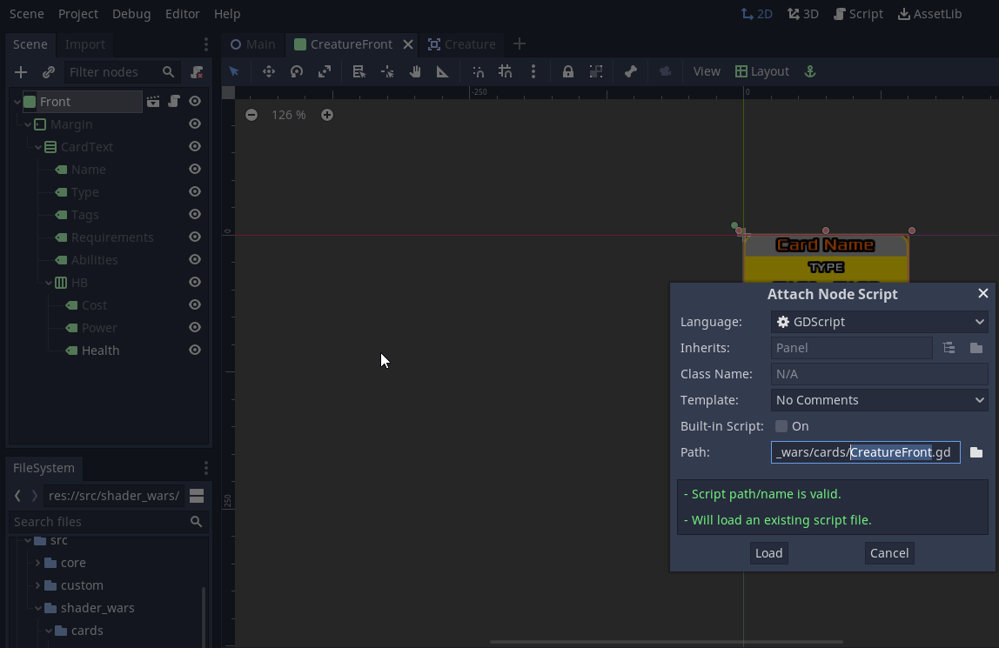
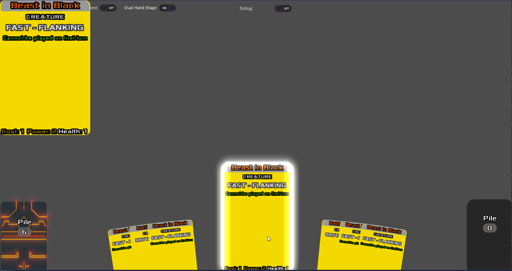

# Godot Card Game Framework Quick Start Guide

**Written for v1.9. Needs update**

This guide is meant to take you through using the Card Game Framework (CGF from now on) for the first time in a simple step-by-step approach, starting from brand a new project.

Hopefully by the end of this tutorial you'll have a better idea of what goes where and how things connect to each other.

Think of this as the "Hello World" instructions for this Framework.


## Step 1: Create new project and setup to use CGF

In this part, we'll create a new project which is going to use the existing CGF demonstration scenes as its baseline.

1. Use Godot to create a new project.
2. Download the latest version of the CGF and extract all directories into your project's root folder.
3. Go to Project > Project Setting > Autoload. Press the browse button and search for `res://src/core/CFControl`. Type "cfc" in the "Node name:" field.
4. Go to Project > Project Settings > General > Application > Run and next to the Main Scene type `res://src/custom/CGFMain.tscn`
5. Close Project Settings and press F5 to play the new project. A basic demo setup will appear and you'll be able to draw cards, move them around etc.

## Step 2: Prepare for customization

In order to be able to upgrade this framework in the future without losing your own customizations, it's strongly suggested you work off inherited scenes. We're going to set that up now, using some of the existing demo scenes as templates as well.

### 2.1 Create custom Board and Info Panel scenes

1. Create a new directory to store your own game's definition. Let's put it in `res://src/new_card_game`
2. In the FileSystem tab, right-click and "Duplicate..." the following files:
	- `res://src/custom/CGFBoard.tscn` >> name the new file `Board.tcsn`.
	- `res://src/custom/CGFBoard.gd` >> name the new file `Board.gd`.
	- `res://src/custom/CGFInfoPanel.tcsn` >> name the new file `InfoPanel.tcsn`.
3. In the FileSystem tab, drag and drop the following files from `res://src/custom` to `res://src/new_card_game`:
	- `Board.tcsn`
	- `Board.gd`
	- `InfoPanel.tcsn`
	- `SP.gd`
4. Double-click `res://src/new_card_game/Board.tcsn` to open it. Right-click on the root node and "Attach Script". Navigate to or type the filepath `res://src/new_card_game/Board.gd`
5. In the FileSystem tab, right-click on `res://src/core/Main.tscn` and select "New Inherited Scene". A new unsaved scene will open.
6. In the Inspector, under "Script Variables", click on "[empty]" next to Board Scene, then "Load", then navigate to `res://src/new_card_game/Board.tcsn`
7. In the Inspector, under "Script Variables", click on "[empty]" next to "Info Panel Scene", then "Load", then navigate to `res://src/new_card_game/InfoPanel.tcsn`
8. Save the unsaved scene as `res://src/new_card_game/Main.tcsn`
9. Press play scene (F6). If you did everything above right, an identicaly demo should run off of your `res://src/new_card_game/` scenes.

We're halfway there, we have now created an inherited Main.tcsn scene which we can customize and we have our own Board.tcsn to modify.

The board is still using a lot of the demo code inside `res://src/custom/` which we need to be able to customize for our own game.

1. In the FileSystem tab, Right-click and select "Duplicate..." on `res://src/custom/CGFDeck.gd`. Name the new file `Deck.gd`.
2. Drag and drop `Deck.gd` inside `res://src/new_card_game`
3. In the Scene View, open `Board.tcsn`. Right-click on the "Deck" node, select "Attach Script", then either navigate to or type `res://src/new_card_game/Deck.gd`
4. Click on the "Deck" node. In the Inspector, select the "Placement" that suits your game.

Repeat this process for `CGFDiscard.gd` and `CGFHand.gd` (naming the new files `Discard.gd` and `Hand.gd` respectively).

**Note:** You could achieve the above by simply detaching the old scripts, then attaching new scripts extending Pile or Hand respectively to your Deck, Discard, or Hand node. However, the 4 steps above also provide some common starting functions for your game such as card draw upon which you can build.

Now you can add custom code to your Deck, Discard and Hand classes. Press F6 again while on the Main scene to ensure all went OK until now

### 2.2 Create a custom card template

Now let's make sure we have a card template dedicated to our own game on which we can build upon

1. In the FileSystem tab, right-click and "Duplicate..." the following files:
	- `res://src/custom/CGFCardManipulationButton.tscn` >> name the new file `CardManipulationButton.tscn`.
	- `res://src/custom/CGFManipulationButtons.gd` >> name the new file `ManipulationButtons.gd`.
2. Drag and drop `CardManipulationButton.tscn` and `ManipulationButtons.gd` inside `res://src/new_card_game`.
3. In the Scene tab, right-click on the "ManipulationButton" node, then "Attach Script" then either nagivate to or type the filepath `res://src/new_card_game/ManipulationButtons.gd`
4. In the Scene tab, click on the "ManipulationButton" node, then in the Inspector click on "[empty]" next to Manipulation Button, then "Load", then navigate to `res://src/new_card_game/CardManipulationButton.tscn`
5. In the FileSystem tab, right-click and "Duplicate..." the following files:
	- `res://src/custom/CGFCardBack.tscn` >> name the new file `CardBack.tscn`.
	- `res://src/custom/CGFCardFront.tscn` >> name the new file `CardFront.tscn`.
	- `res://src/custom/CGFCardFront.gd`  >> name the new file `CardFront.gd`.
6. Drag and drop `CardBack.tscn`, `CardFront.tscn`  and `CardFront.gd` inside `res://src/new_card_game`.
7. Double-click `res://src/new_card_game/CardFront.tcsn` to open it. Right-click on the root node and "Attach Script", then either navigate to or type the filepath `res://src/new_card_game/CardFront.gd`
8. Right-click on `res://src/core/CardTemplate.tscn` and select "New Inherited Scene". A new unsaved scene will open.
9. Click on the root node in `CardTemplate.tcsn`.

**NOTE:** If you cannot follow the next two steps because you cannot find the "Card Back Design" and "Card Front Design" fields, then select Project > Reload Current Project in the Godot menu.

10. In the Inspector click on "[empty]" next to Card Back Design, then "Load" then navigate to `res://src/new_card_game/CardBack.tcsn`
11. In the Inspector click on "[empty]" next to Card Front Design, then "Load", then navigate to `res://src/new_card_game/CardFront.tcsn`
12. Save the unsaved Scene as `res://src/new_card_game/CardTemplate.tcsn`

You'll notice again we're duplicating some of the demo code.  We could easily do the same by simply creating new scenes and scripts from scratch, but for a quickstart, this provides us with similar functionality as the demo, which we can build upon.

### 2.3 Point game to new custom cards

We have now created an inherited card scene as well as custom card back card front and manipulation button scenes which we can modify to fit our game look.

However typically the games don't have only one card, so we need to let our game know where our game stores its custom cards.  At the moment, the Framework is configured to look inside `res://src/custom`, but we cant to make sure it's looking inside our own folder.

1. Move `res://src/custom/CFConst.gd` to `res://src/new_card_game/`
2. Create a new folder `res://src/new_card_game/cards`
3. Create a new folder `res://src/new_card_game/cards/sets`
4. In the FileSystem tab, navigate to `res://src/custom/cards`.
5. Move `CardConfig.gd` and `CustomScripts.gd` to `res://src/new_card_game/cards`
6. Move `res://src/custom/cards/sets/SetPreload.gd` to `res://src/new_card_game/cards/sets/`
7. Edit `res://src/new_card_game/CFConst.gd`
8. Find the line `const PATH_CUSTOM := "res://src/custom/"` and modify it to `const PATH_CUSTOM := "res://src/new_card_game/"`

Now our game will be looking for custom card configurations (Card Definitions, Card Scripts etc) inside our new directory structure.

Press Run Scene (F6) on our `res://src/new_card_game/Main.tcsn` scene. The same demo board should appear, but the deck will be empty. This is because we have not defined any cards yet. But before we do that, we need to create our new card Types. We'll do that in the next section.

If everything went OK, we can now use our new Main scene. Open your project settings and Change Application > Run > Main Scene to `res://src/new_card_game/Main.tcsn`. Run the whole project with F5 to verify

## Step 3: Create a new card type

In this part, we'll create our first new card type which will serve as the baseline for a specific subset of cards.

For this demonstration, let's create a "creature" type card.

1. In the Godot Filesystem view, navigate to `res://src/new_card_game/`
2. Right-click on `CardFront.tcsn` and select "New Inherited Scene". A new tab will open on the top called "[unsaved]". Press "F1" to ensure you're on the 2D view. You should see a grey card. This is the card front baseline coming from the CGF. We're now going to modify that to fit our purposes.
3. In the Godot Scene tab, double-click on "Front" to rename the scene root. Let's rename it to "CreatureFront" to remind ourselves what this is when working on our scenes. It's not otherwise important.
4. On the Inspector find and expand custom styles. Then click on the arrow next to StyleBox and select "Make Unique".
5. Click on the "StyleBox" label, to expand its properties
6. Click on the "Bg Color". The colour picker will appear. Select a background colour you want to use for your creature cards.
7. The basic card template has most of the information a creature would need, but what would a creature be without some Health. Let's add this now.
	1. Right-click on Power > Duplicate. The new label node will appear under the "Power" node called "Power2".
	1. Double click "Power2" to rename it to "Health". You can add text to see how it looks.
	2. Right-click on PowerIcon . Duplicate. The new icon node will appear under the "PowerIcon" node called "PowerIcon2"
	2. Double click "PowerIcon2" to rename it to "HealthIcon". Drag it to move it just above "Health".
	3. Click on HealthIcon. and then click on the little arrow next to the "Texture" property. Select Quickload and write "hearts". Select the hearts.png option.
14. Since we're not creating a completely different front, we can just extend the existing default front script we're using for our game. Right click on the root node (should be called "Front") And select "extend script". A new window will popup will the script name to save. save it as `res://src/new_card_game/cards/CreatureFront.gd`.
	
15. The new script will open. Add the text to the `_ready()` method as below
```
func _ready() -> void:
	card_labels["Health"] = find_node("Health")
```
We have now mapped the new label node for our new card type, so that it can be found by our code.

1. Save the Scene as `res://src/new_card_game/cards/CreatureFront.tcsn`
2. Right-click on `res://src/new_card_game/CardTemplate.tcsn` and select "New Inherited Scene". A new tab will open on the top called "[unsaved]".
3. In the Godot Scene tab, double-click on "Card" to rename the scene root. Let's rename it to "Creature" to remind ourselves what this is when working on our scenes. It's not otherwise important.
4. In the root node inspector, click on the arrow next to Card Front Design > Load, then navigate and select `res://src/new_card_game/cards/CreatureFront.tcsn`
5. Press Ctrl+S to save our new scene as `res://src/new_card_game/cards/Creature.tcsn`. We now have our new card type scene template, but our game is not configuration to populate it just yet.
6. Open `res://new_card_game/card/CardConfig.gd`. This is where we specify what kind of information each label adds. Since the health of each creature is just a number, we'll add it as a number.
7. Edit `PROPERTIES_NUMBERS` and modify the array definition look like this

```
const PROPERTIES_NUMBERS := ["Cost","Power","Health"]
```

Now our creature template is ready to use.

## Step 4: Define a new card of the new type.

In this part, we'll define our card using a simply json format which will automatically create that card when we request that card name to be added.

1. Make a copy of `res://src/custom/cards/sets/SetDefinition_Demo1.gd` as `res://src/new_card_game/cards/sets/SetDefinition_Core.gd`
2. Make a copy of `res://src/custom/cards/sets/SetScripts_Demo1.gd` as `res://src/new_card_game/cards/sets/SetScripts_Core.gd`

These 2 steps are not strictly necessary, but it will give us some preconstructed dictionaries to modify later.

1. Edit `res://src/new_card_game/cards/sets/SetDefinition_Core.gd`
2. You should see two cards defined coming from the Framework Demo. We're going to remove them and define two creatures instead.
3. Modify the contents as so:
```
extends Reference

const SET = "Core Set"
const CARDS := {
	"Battle Beast": {
		"Type": "Creature",
		"Tags": ["Brutal", "Slow"],
		"Requirements": "",
		"Abilities": " ",
		"Cost": 2,
		"Power": 3,
		"Health": 3,
	},
	"Beast in Black": {
		"Type": "Creature",
		"Tags": ["Fast", "Flanking"],
		"Requirements": "Cannot be played on first turn",
		"Abilities": " ",
		"Cost": 1,
		"Power": 2,
		"Health": 1,
	},
}
```

Since you're reusing the CGFBoard.tcsn demonstration code, the new cards will automatically be included in the starting deck. Try it out now!

Press F5 and draw some cards. Your "Beast" cards should be the only options.

Congratulations, you have now created your own customized workspace, defined your first card type, and created your first cards to use it!



Hopefully this will give you a basic idea of where things are. Continue exploring and changing things and you should be able to customize the framework to your needs in no-time.

Have fun!

## Addendum 1: Making it look nicer

You may think the bottom of the card is now a bit crowded. It might ever cause Health to overflow the card size. It might better if we just displayed the numerical value, and instead separated them via a "/".

How would you achieve that?
* **Hint:** Try reducing or removing the "Health" and "Power" entry from `res://src/new_card_game/CardFront.gd`. What happens to the size of the label font in runtime now?
* **Hint:** Check what happens if you move "Power" and "Health" from CardConfig.PROPERTIES_NUMBERS to CardConfig.PROPERTIES_STRINGS.
* Think how you could modify the node layout of Health and Power so that they are together in own HBoxContainer and separated by a new label having just the "/" text. You would also need to adjust their mapping in `_init_front_labels()` in the Creature.gd. How?

## Addendum 2: How Is Babby Formed?

If you're wondering how the Initial cards you see starting in the deck are added, this is all defined inside `res://src/new_card_game/Board.gd`. Inside `_ready()` you'll find a call to `load_test_cards()` which loads the deck with a random selection of cards among all those defined. This is why your "Beasts" magically appeared in the deck without you having to do anything else after defining it. Your game should of course include some logic in creating, storing and loading decks instead of relying on random chance. But this is currently outside the scope of this framework (at this point).

## Addendum 3: Core Concepts

The CGF tries to standardize some standard terms in order to keep track of what we're talking about.

* **Card:** A card is the core concept of our card game. In CGF, the Card class holds the logic for manipulating and moving card scenes around.
* **CardContainer:** As understood from the name, this is a container which is meant to hold cards. This term is a supergroup which contains both piles and hands
* **Hand:** A CardContainer which is meant to hold cards face up, and oriented in a way that they're all visible to the player.
* **Pile:** A CardContainer which is meant to hold cards stacked on top of each other. The deck and discard pile would be Piles.
* **Board:** The play area where cards can be placed and where the main game happens.
* **Manipulation Button:** A button which appears on a Card or CardContainer when you mouse over it. Code can be attached to it to do practically anything, but they tend to manipulate the object they're attached to in some way.
* **Token:** a counter that goes on a card to track and measure various changes as dictated by the game rules
