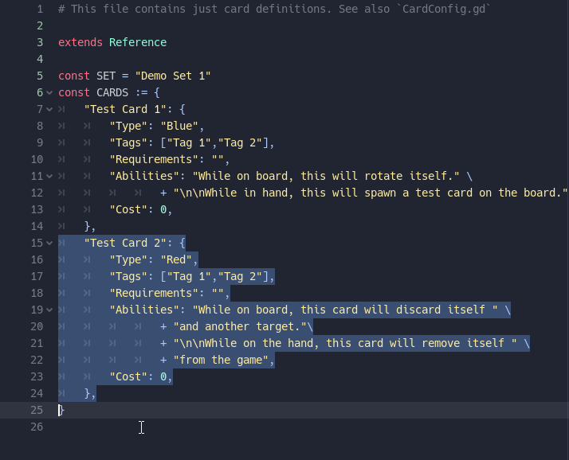
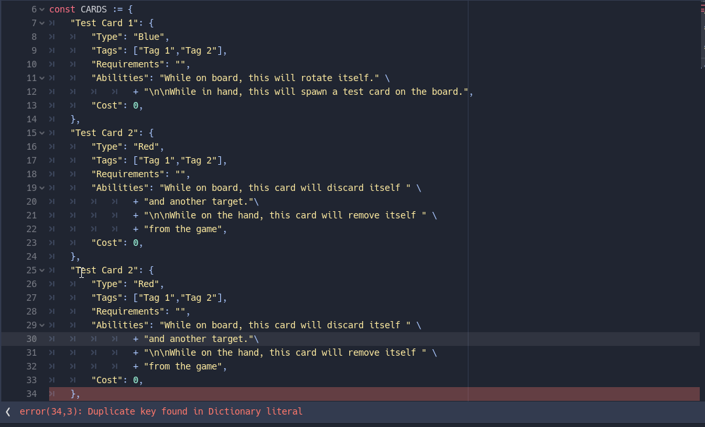
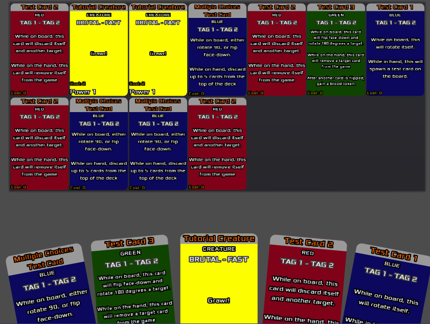

# Godot Card Game Framework Quick Start Guide

This guide is meant to take you through using the Card Game Framework (CGF from now on) for the first time in a simple step-by-step approach, starting from brand a new project.

Hopefully by the end of this tutorial you'll have a better idea of what goes where and how things connect to each other. 

Think of this as the "Hello World" instructions for this Framework.

## Core Concepts

The CGF tries to standardize some standard terms in order to keep track of what we're talking about. 

* Card: A card is the core concept of our card game. In CGF, the Card class holds the logic for manipulating and moving card scenes around.
* CardContainer: As understood from the name, this is a container which is meant to hold cards. This term is a supergroup which contains both piles and hands
* Hand: A CardContainer which is meant to hold cards face up, and oriented in a way that they're all visible to the player.
* Pile: A CardContainer which is meant to hold cards stacked on top of each other. The deck and discard pile would be Piles.
* Board: The play area where cards can be placed and where the main game happens.

## Step 1: Create new project and setup to use CGF

In this part, we'll create a new project which is going to use the existing CGF demonstration scenes as its baseline.

1. Use godot to create a new project. 
2. Download the latest version of the CGF and extract all directories into your project's root folder. You only need src for this tutorial however, so feel free to extract just that if you know what you're doing. The files should appear in your filesystem view.
3. Go to Project > Project Setting > Autoload. Press the browse button and select for src/core/CFControl. Type "cfc" in the "Node name:" field.
4. Go to Project > Project Settings > General > Application > Run and next to the Main Scene type `res://src/core/Main.tscn`
5. Close Project Settings and press F5 to play the new project. A basic demo setup will appear and you'll be able to draw cards, move them around etc.

## Step 2: Create a new card type

In this part, we'll create our first new card type which will serve as the baseline for a specific subset of cards.

For this demonstration, let's create a "creature" card.

1. In the Godot Filesystem view, navigate to `res://src/core/`
2. Right-click on `CardTemplate.tcsn` and select "New Inherited Scene". A new tab will open on the top called "[unsaved]". Press "F1" to ensure you're on the 2D view. You should see a grey card scene. This is the baseline coming from the CGF. We're not going to modify that to fit our purposes.
3. In the Godot Scene tab, double-click on "Card" to rename the scene root. Let's rename it to "Creature" to remind ourselves what this is when working on our scenes.
4. In the scene, navigate and click on the "Control/Front" node. 
5. In the inspector, find and expand custom styles. Then click on the arrow next to StyleBox and select "Make Unique".
6. Click on the "StyleBox" label, to expand its properties
7. Click on the "Bg Color". The colour picker will appear. Select a background colour you want to use for your creature cards.
8. The basic card template has most of the information a creature would need, but what would a creature be without some Fighting power. Let's add this now. 
	Right click on Cost > search for Label and add it. The new node will appear under the "Cost" label.
9. Double click it to rename it to "Power". You can add some sample power to see how it looks. If you cannot see it against the background colour, you will need to adjust the font. Let's provide a setup which should work with any background colour now.
10. With Power selected, in the inspector expand "Custom Fonts". Click on "[empty]" and select "New Dynamic Font". 
11. Click on the "Dynamic Font" dropdown to open its properties. Click on "Font". Click on "[empty]" next to Font Data. Select "load". If you've copied the "fonts" directory into your project, browse into res://src/fonts and select xolonium. Otherwise load any other font file you would like.
12. Under "Font" expand settings. Put "Outline size" to 2 and "Outline color" to black. Check "use filter". White fonts with black outline should be visible against any background.
13. Press Ctrl+S to save our new scene. Naviate to `res://src/custom/cards` and save it as `Creature.tcsn`. We now have our template scene, but our game is not configuration to populate it just yet.
14. Open `res://custom/card/CardConfig.gd`. This is where we specify what kind of information each label adds. Since the power of each creature is just a number, we'll add it as a number.
15. Edit `PROPERTIES_NUMBERS` and modify the array definition look like this 
	
   ```const PROPERTIES_NUMBERS := ["Cost","Power"]```
	
Now our creature template is ready to use.

## Step 3: Define a new card of the new type.

In this part, we'll define our card using a simply json format which will automatically create that card when we request that card name to be added.

1. Under `res://src/custom/cards/sets` open One of the "SetDefinition_Demo1" file. 
2. You should see two cards defined. We're just going to add the new one below them.
3. Using your mouse, select the definition of the second card. 
	
4. Press Ctrl+D to duplicate it. Godot should start complaining about a Duplicate key now.
	

5. Edit the text you just copied so that "Test Card 2" becomes "Tutorial Creature"
6. Change "Type" to "Creature". This tells the card to use your Creature.tcsn scene you just created
7. You can leave the other properties as they are, or change them. But we need to define its power. So move your cursor to the "cost" line and again press Ctrl+D to duplicate it.
8. Rename the key of the new line to "Power" and set the number to anything.
	

Since you're using the tutorial code. The card will automatically be included in the test deck. Try it out now. Press F5 and draw some cards. your "Tutorial Creature" card should appear randomly among the cards drawn. If it didn't, maybe you got very unlucky, just reload the game. ;)

Congratulations, you have now defined your first card! 

	

Hopefully this will give you a basic idea of where things are. Continue exploring and changing things and you should be able to customize the framework to your needs in no-time. 

Have fun!

## Addendum: How Is Babby Formed?

If you're wondering how the Initial cards you see starting in the deck are added, this is all defined inside `res://src/custom/Board.gd`. Inside `ready()` you'll find a call to `load_test_cards()` which loads the deck with a random selection of cards among all those defined. This is why your `Tutorial Creature` magically appeared in the deck without you having to do anything special. Your game should of course include some logic in creating, storing and loading decks instead of relying on random chance. But this is currently outsided the scope of this framework.